# Kitten Trail


**Author:** `cocomelonc`<br>
**Copyright:** © 2026 cocomelonc (Zhassulan Zhussupov)

Kitten Trail is a tiny, calm Android game about guiding a kitten through nine
gentle landscapes, collecting three stars, and returning to a warm little
house. There are no ads, accounts, purchases, trackers, network calls, timers,
lives, or game-over screens.

The game starts in English and includes an in-game `EN / RU` language switch.
Both Latin and Cyrillic use the same bundled Nunito typeface, so typography is
consistent on every Android device.

### Screenshots

| English | Русский |
|---|---|
| 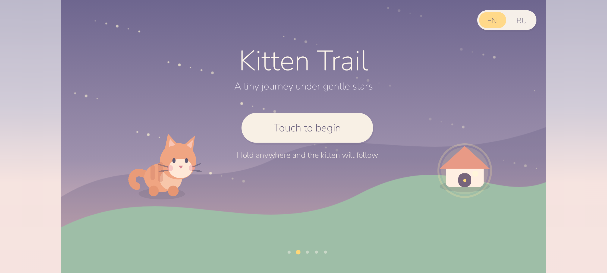 | 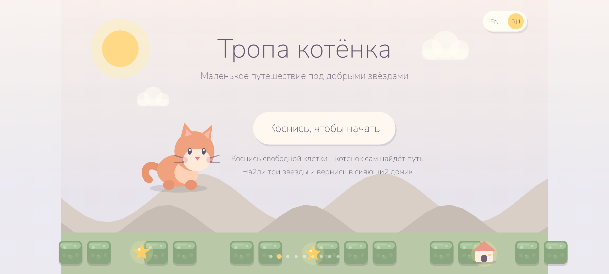 |

The pause card uses a wide safe area, 72 logical pixels of horizontal content
padding, and a smooth fade-and-scale entrance. Longer Russian text is measured
and fitted inside the same margins.

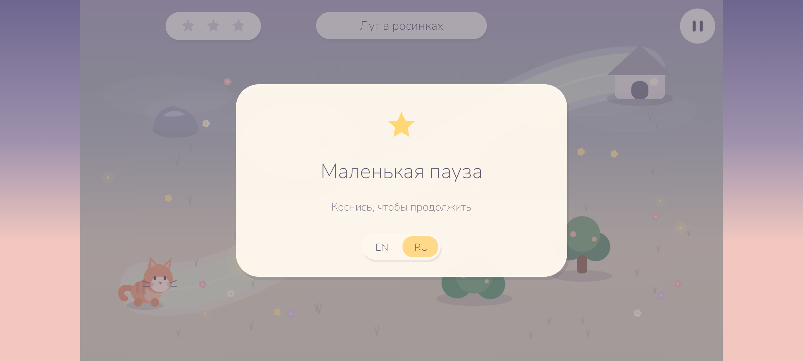

### Levels

Each landscape has its own gentle palette, path, and obstacle arrangement.

**Dewdrop Meadow**<br>
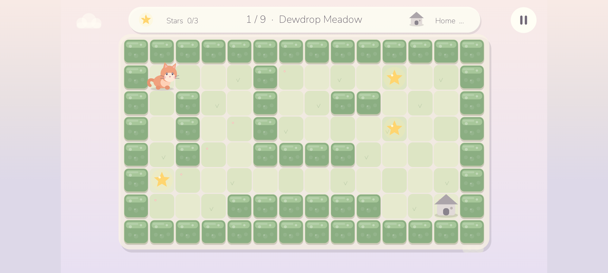     

**Lavender Garden**<br>
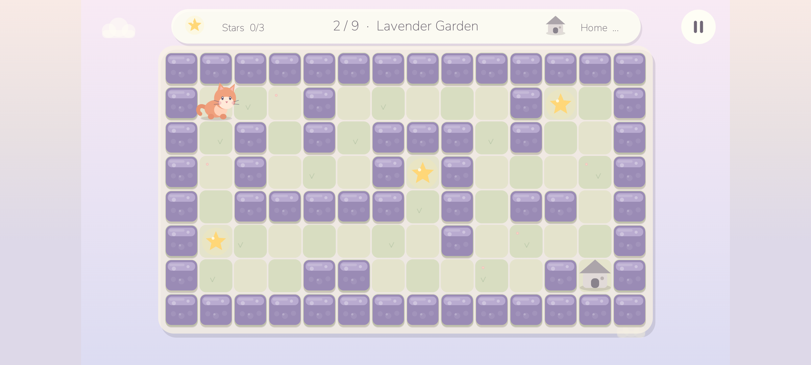    

**Moonlit Pond**<br>
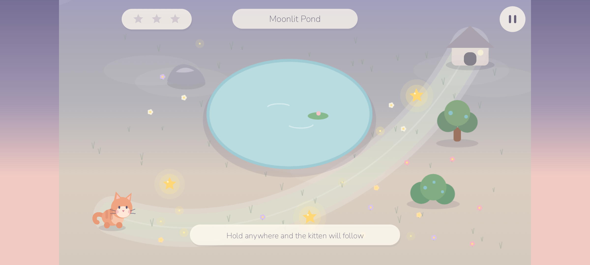    

**Peach Orchard**<br>
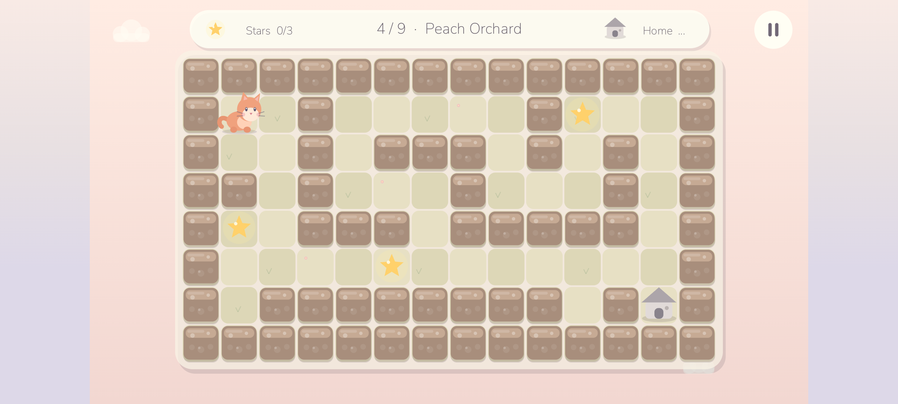   

**Starry Hill**<br>
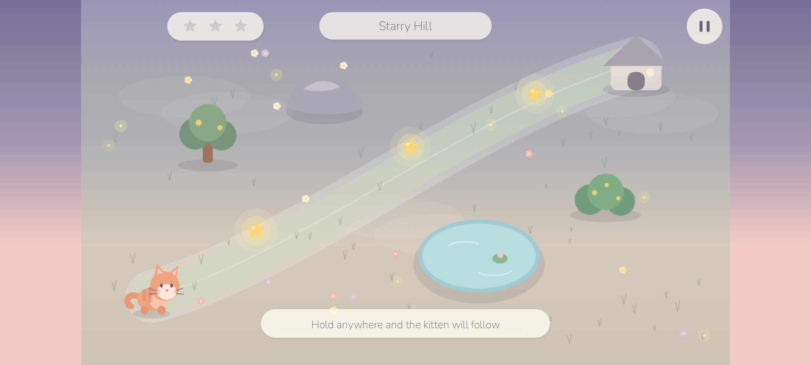    

**Cotton Cloud Valley**<br>
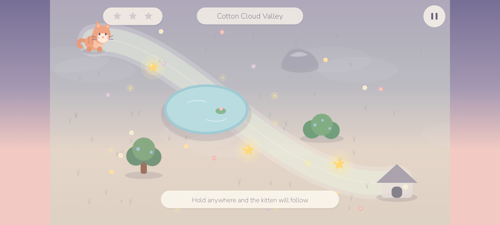    

**Rose Petal Path**<br>
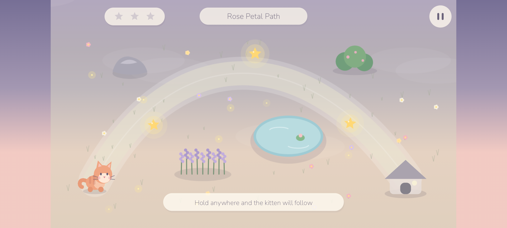    

**Minty Brook**<br>
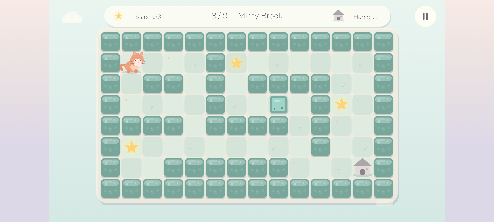    

**Golden Twilight**<br>
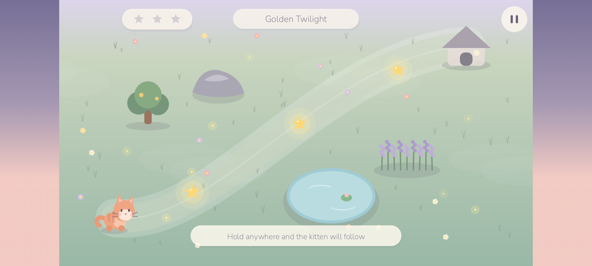    

### Why it is deliberately small

- One-finger play: hold anywhere and the kitten follows.
- Nine short handcrafted levels with soft collision and no failure state.
- Hardware-accelerated Android Canvas; no game engine or native `.so` files.
- Procedural vector-like artwork that stays sharp at every screen density.
- Local progress only, stored in `SharedPreferences`.
- English and Russian resources bundled in every APK/AAB.
- Procedural bell sounds; no audio codec dependency.

### Android configuration

| Setting | Value |
|---|---:|
| Application ID | `com.cocomelonc.kittentrail` |
| Minimum SDK | 26 (Android 8.0) |
| Target SDK | 36 (Android 16) |
| Compile SDK | 36 |
| Java | 17 |
| Android Gradle Plugin | 8.9.1 |
| Gradle | 8.11.1 |

Because the application contains no native ELF libraries, Android's 16 KB
memory-page compatibility requirement does not apply to project code. The
verification script also checks that no `.so` file enters the APK.

`minSdk` controls the oldest Android release that can install the app, while
`targetSdk` opts the app into the behavior rules of that Android generation.
The APK declares `minSdk 26`, so Android 15/API 35 is comfortably inside its
supported range, and declares `targetSdk 36` for Android 16 behavior. See the
official Android [`<uses-sdk>` documentation](https://developer.android.com/guide/topics/manifest/uses-sdk-element).

The complete debug build was clean-installed and exercised on a Pixel 7
emulator running Android 16/API 36: English and Russian switching, Cyrillic
font rendering, touch movement, star collection, collision, audio, haptics,
level completion, app backgrounding, and safe resume-to-pause. Automated tests
also prove reachability for every objective in all nine levels.

### Build

Install JDK 17 and Android SDK Platform 36, then run:

```bash
export ANDROID_HOME="$HOME/Android/Sdk"
export JAVA_HOME=/path/to/jdk-17
./gradlew testDebugUnitTest lintDebug assembleDebug
```

The debug APK is written to:

```text
app/build/outputs/apk/debug/app-debug.apk
```

For a Play-ready Android App Bundle artifact:

```bash
./gradlew bundleRelease
```

The release AAB is unsigned. Configure your own upload key outside the
repository; never commit a keystore or its passwords.

### Verification

```bash
./scripts/verify_android.sh
```

It runs unit tests, strict lint, builds the APK, verifies its signature and ZIP
alignment, confirms `minSdk=26` / `targetSdk=36`, and rejects unexpected native
libraries.

The unit tests also perform a grid reachability check from the kitten's start
position to every star and every home in all nine levels.

### Controls

- Hold and move one finger: guide the kitten.
- Release: stop.
- Top-right pause button or Android Back: pause.
- `EN / RU`: switch language on the title or pause screen.

### Project layout

```text
app/src/main/java/com/cocomelonc/kittentrail/
  MainActivity.java       edge-to-edge Android host and lifecycle
  KittenTrailView.java    drawing, touch input, particles and UI
  GameWorld.java          testable game rules and collision
  LevelData.java          nine immutable handcrafted levels
  AudioEngine.java        tiny procedural chime synthesizer
app/src/test/             gameplay and level reachability tests
art/                      open-source cover and its generation notes
third_party/nunito/       exact SIL OFL license for the bundled font
scripts/                  reproducible Android verification
```

### Privacy and children

The app is intentionally offline and does not collect or transmit data. See
[PRIVACY.md](PRIVACY.md). If you publish a modified build with analytics,
advertising, accounts, or network services, its privacy declarations and
Google Play Families answers must be updated.

### License

Project source and original project artwork are available under the MIT
License. Nunito remains under the SIL Open Font License 1.1; see
[`third_party/nunito/OFL.txt`](third_party/nunito/OFL.txt).

Kitten Trail was created by **cocomelonc**. The author and copyright notices
must remain in copies and substantial portions of the project as required by
the MIT License. See [AUTHORS.md](AUTHORS.md) and [LICENSE](LICENSE).

Contributions and translations are welcome. See [CONTRIBUTING.md](CONTRIBUTING.md).

---

### Русский

Kitten Trail - маленькая спокойная Android-игра: помогите котёнку найти три
звезды и вернуться в тёплый домик. Здесь нет рекламы, регистрации, покупок,
аналитики, сети, смертей и экрана проигрыша.

Игра запускается на английском; язык можно в любой момент переключить на
русский кнопкой `EN / RU`. Один и тот же встроенный шрифт Nunito используется
для латиницы и кириллицы. Сборка и проверка описаны выше; основной артефакт -
обычный Android-проект с `targetSdk 36` и `minSdk 26`.
